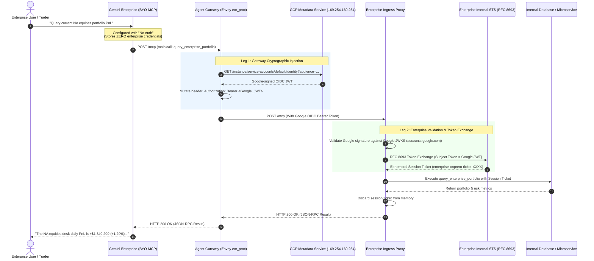

# Gemini Enterprise BYO-MCP: 2-Legged OAuth & Token Exchange Integration

[](https://cloud.google.com/products/agent-gateway)
[](https://cloud.google.com/gemini)
[](https://www.envoyproxy.io/)
[](#security--compliance-highlights)

A production-grade architectural pattern and reference implementation for integrating **Gemini Enterprise Bring Your Own MCP (BYO-MCP)** with internal enterprise systems under **strict zero-secret residency policies**.

---

## 🎯 Executive Problem & Objectives

Enterprises in highly regulated sectors (e.g., financial services, quantitative trading, healthcare) often enforce a non-negotiable security requirement:

> **Zero Third-Party Secret Residency:** No customer OAuth `client_secret`s, private keys, or persistent on-premises user session tokens may ever be stored or persisted inside external SaaS / Cloud platforms (including Google Cloud / Gemini Enterprise).

### Standard BYO-MCP vs. Enterprise Requirement
* **Standard Pattern:** Gemini Enterprise BYO-MCP out-of-the-box expects the cloud to store OAuth client secrets and manage upstream authentication tokens.
* **The 2-Legged Pattern (This Solution):** Gemini Enterprise is configured with **"No Auth"** (plain JSON-RPC). Egress traffic passes through Google Cloud's **Agent Gateway**, where an Envoy `ext_proc` Service Extension dynamically mints and injects a signed **Google Cloud OIDC identity assertion** for a Customer-Managed Service Account (CMSA). The enterprise proxy validates the Google signature, exchanges it with its internal Security Token Service (STS) for an ephemeral internal ticket, executes the tool, and immediately discards the token.

---

## 🏛️ Architecture Overview



---

## 🧩 Key Components

| Component | Technology | Role |
| :--- | :--- | :--- |
| **Gemini Enterprise** | Google Cloud BYO-MCP | Configured with `No Auth`. Emits standard JSON-RPC tool calls without holding any customer secrets. |
| **Agent Gateway Extension** | Python, gRPC, Envoy `ext_proc` v3 | Intercepts egress requests, queries the Compute Engine metadata server (`169.254.169.254`), and injects `Authorization: Bearer <Google_JWT>`. |
| **Enterprise Proxy** | Node.js Express / Go / Python | Edge gateway that strictly rejects unauthenticated calls (HTTP 401) and verifies incoming Google OIDC tokens against Google public JWKS. |
| **Enterprise STS** | RFC 8693 OAuth Token Exchange | Issues short-lived, scoped on-premise session tickets upon validating Google Cloud identity assertions. |

---

## 📂 Repository Structure

```
byomcp-2legged-oauth/
├── service-extension/              # Agent Gateway Envoy ext_proc service
│   ├── enterprise_ext_proc.py      # Core gRPC server minting OIDC tokens
│   ├── authz-extension.yaml        # GCP Network Services AuthzExtension declaration
│   ├── authz-policy.yaml           # GCP Network Security AuthzPolicy declaration
│   ├── deploy.sh                   # Automated build & deploy script for Cloud Run
│   ├── Dockerfile                  # Container definition for ext_proc service
│   ├── requirements.txt            # Python dependencies (grpcio, xds-protos, etc.)
│   ├── test_client.py              # Envoy callout simulator
│   └── test_end_to_end.py          # Complete 5-stage verification test suite
├── mock-server/                    # Mock Enterprise Ingress Proxy & STS
│   ├── server.js                   # Express server implementing MCP & simulated STS
│   ├── package.json                # Dependencies (express, jsonwebtoken, jwks-rsa)
│   └── Dockerfile                  # Container definition for mock proxy
├── docs/                           # Detailed architecture & sequence documentation
│   └── architecture-guide.md       # Comprehensive architectural deep-dive
└── README.md                       # Main documentation
```

---

## 🚀 Quickstart: Local Verification

You can run the entire 2-legged verification locally to observe the handshake, unauthenticated rejection, gateway token injection, and token exchange.

### 1. Start the Mock Enterprise Proxy
```bash
cd mock-server
npm install
node server.js
```
*Proxy will listen on `http://localhost:8080/mcp`.*

### 2. Start the Service Extension (Envoy `ext_proc`)
In a second terminal:
```bash
cd service-extension
python3 -m venv venv
source venv/bin/activate
pip install -r requirements.txt
python3 enterprise_ext_proc.py
```
*Token injector will listen on gRPC `localhost:50051`.*

### 3. Run the End-to-End Test Suite
In a third terminal:
```bash
cd service-extension
source venv/bin/activate
python3 test_end_to_end.py
```

### Expected Output:
```text
=================================================================
Enterprise 2-Legged MCP Architecture - End-to-End Verification Test
=================================================================

[Step 1] Testing MCP Initialize handshake...
  • Server: mock-enterprise-proxy v1.0.0
  • Result: PASSED ✅

[Step 2] Testing MCP tools/list...
  • Discovered: ['query_enterprise_portfolio', 'get_enterprise_system_status']
  • Result: PASSED ✅

[Step 3] Testing direct unauthenticated tool call (Zero-Auth simulation)...
  • Response: HTTP 401 Unauthorized
  • Result: PASSED ✅ (Enterprise proxy safely blocks unauthenticated requests)

[Step 4] Requesting Google OIDC Token via ext_proc service on port 50051...
  • ext_proc injected header: Bearer eyJhbGciOiJSUzI1Ni...
  • Result: PASSED ✅

[Step 5] Testing authenticated tool call with injected Google OIDC token...
  • Response: HTTP 200 OK
  • Generated Ticket: enterprise-onprem-ticket-XXXX
  • Returned Portfolio Data:
      - Desk: equities-na
      - Net Market Value: $142,500,000 USD
      - Daily PnL: +$1,840,200 USD (+1.29%)
  • Full End-to-End Flow: SUCCESS! ✅
=================================================================
```

---

## ☁️ Google Cloud Deployment

To deploy the Service Extension onto a live Google Cloud Agent Gateway:

1. Configure your Google Cloud environment:
   ```bash
   gcloud config set project YOUR_PROJECT_ID
   ```
2. Run the deployment script:
   ```bash
   cd service-extension
   chmod +x deploy.sh
   ./deploy.sh
   ```
   *This automatically builds the container, deploys it to Cloud Run with gRPC HTTP/2 enabled, creates the Serverless NEG and Backend Service, and applies the `AuthzExtension` and `AuthzPolicy` resources to your Agent Gateway.*

3. In Gemini Enterprise Console:
   - Go to **Data Stores / Integrations** $\rightarrow$ **Add Tool** $\rightarrow$ **Custom MCP Server**.
   - Set **Authentication Type** to: **`No Auth`**.
   - Set the **MCP Server URL** to point through the Agent Gateway / PSC endpoint.

---

## 🛡️ Security & Compliance Highlights

1. **Zero Secret Residency:** Google Cloud and Gemini Enterprise store zero enterprise passwords, API keys, or client secrets.
2. **Cryptographic Identity Attestation:** Identity assertions are signed directly by Google's root identity provider (`accounts.google.com`) and cryptographically validated via Google JWKS.
3. **Customer-Managed Service Account (CMSA):** Runs strictly under customer-governed IAM principles (`enterprise-mcp-extproc@...`), providing complete auditability in Cloud Logging.
4. **Ephemeral Internal Tickets:** On-premise session tickets generated by the enterprise STS are short-lived and discarded immediately after tool completion.
5. **Fail-Closed Security:** The `AuthzExtension` is configured with `failOpen: false`, ensuring requests are immediately blocked if the identity injector is unreachable.
