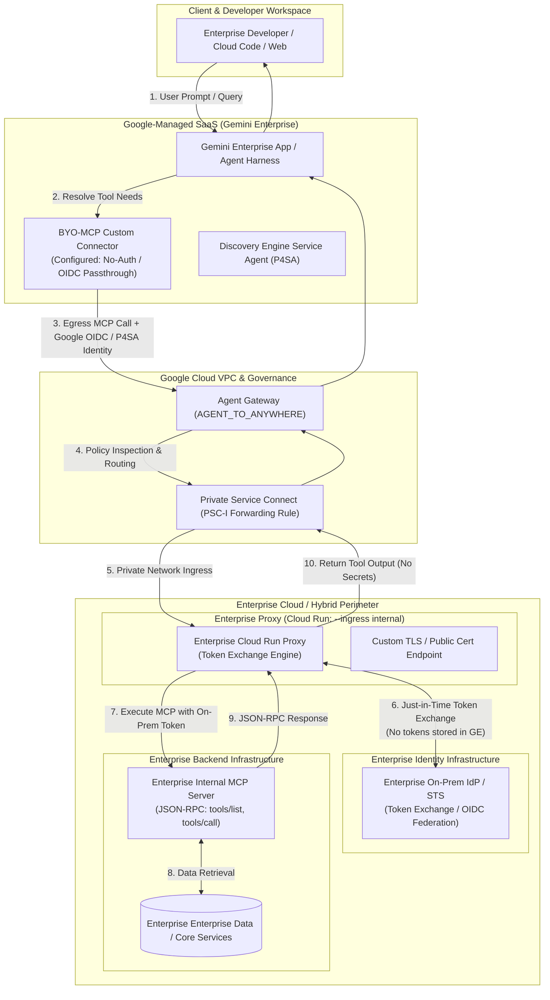
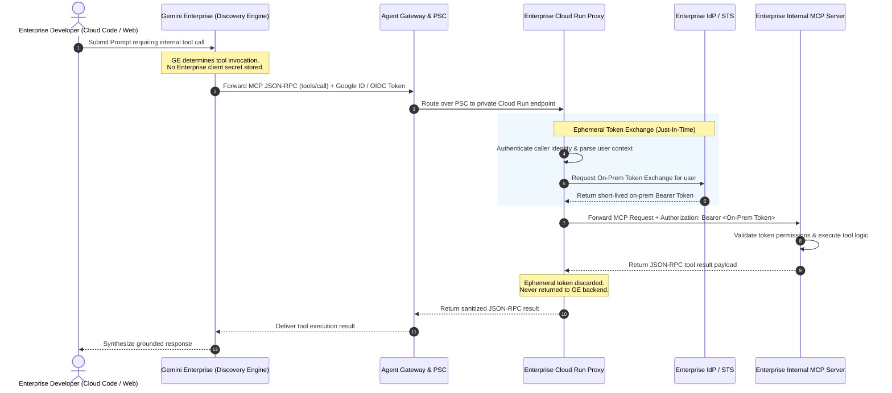
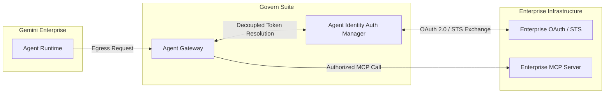
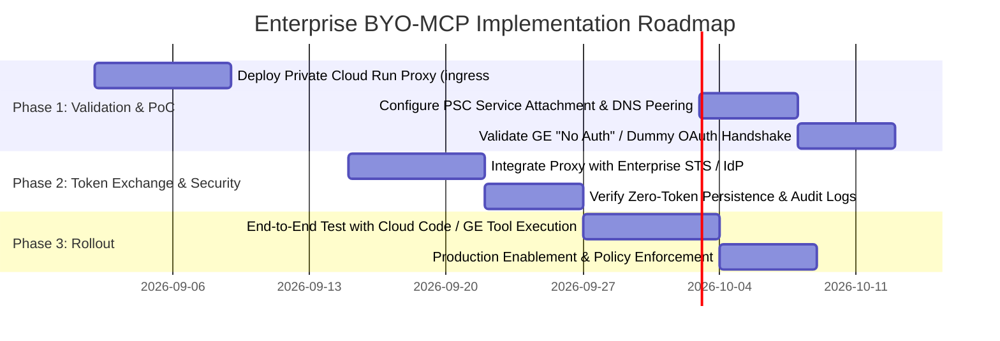

# Technical Architecture & Strategy Proposal
# Secure Bring-Your-Own-MCP (BYO-MCP) Integration for Gemini Enterprise
**Customer Context:** Enterprise Enterprise Integration  
**Document Status:** Draft for Review  
**Date:** September 2026  

---

## 1. Executive Summary

This document evaluates architectural options for enabling **Bring Your Own Model Context Protocol (BYO-MCP)** within **Gemini Enterprise (GE)** and **Cloud Code / Developer IDEs** for Enterprise.

Enterprise currently operates an internal authentication proxy on Cloud Run that performs dynamic token exchange, ensuring that sensitive enterprise credentials and on-prem user tokens are never persisted in developer harnesses, client runtimes, or external AI platforms.

Standard Gemini Enterprise BYO-MCP architecture expects enterprise administrators to register static OAuth 2.0 Web Client credentials (`client_id`, `client_secret`) and store user authorization tokens (access/refresh tokens) within the Google-managed Discovery Engine backend. This conflicts with Enterprise’s enterprise security policies.

This document proposes and contrasts two primary architectural solutions:
1. **Option 1 (Proxy-Mediated PSC Architecture - Recommended Near-Term):** Deploy Enterprise’s Cloud Run Proxy as a private endpoint behind Google Cloud **Private Service Connect (PSC)** and **Agent Gateway**. Gemini Enterprise connects in a "No-Auth" / identity-propagating egress mode; the proxy intercepts the MCP payload, performs real-time token exchange against Enterprise’s Security Token Service (STS) / Identity Provider (IdP), and forwards authorized MCP JSON-RPC calls (`initialize`, `tools/list`, `tools/call`) to Enterprise's private MCP servers.
2. **Option 2 (Agent Gateway + Agent Identity Auth Manager):** Leverage native Google Cloud Agent Platform integration where Agent Gateway and Auth Manager mediate the token exchange lifecycle without raw credentials exposed to the agent runtime.

---

## 2. Customer Security & Compliance Requirements

| ID | Requirement | Rationale / Driver |
| :--- | :--- | :--- |
| **REQ-1** | **Zero Client Secret Storage on GCP Backend** | Enterprise will not store internal MCP server OAuth client secrets in Gemini Enterprise, Discovery Engine, or third-party SaaS backends. |
| **REQ-2** | **Zero Persistent User On-Prem Tokens on GCP Backend** | On-premise user access tokens and long-lived refresh tokens must never reside or be cached in Google-managed data stores. |
| **REQ-3** | **Per-User Identity & Audit Accountability** | MCP tool invocations must execute with the distinct identity and least-privilege permissions of the invoking user, not a shared system-level service account. |
| **REQ-4** | **Private Network Isolation (VPC-SC / PSC)** | Tool execution traffic must transit private, non-routable IP interconnects without traversing the public internet. |
| **REQ-5** | **Decoupled Token Exchange** | Token acquisition and validation must occur just-in-time via Enterprise’s trusted token exchange proxy. |

---

## 3. Current State vs. Standard Gemini Enterprise BYO-MCP Flow

### 3.1 Standard Gemini Enterprise BYO-MCP Architecture (GCP Baseline)
In the default Gemini Enterprise Custom MCP Connector setup:
* **Admin Setup:** Admin enters MCP Server URL, Authorization URL, Token URL, `Client ID`, and `Client Secret` into the Gemini Enterprise Console.
* **User Authentication:** When a developer triggers an MCP tool, they undergo a standard 3-Legged OAuth (3LO) consent flow.
* **Token Storage:** Gemini Enterprise backend (`vertexaisearch.cloud.google.com`) stores the resulting `refresh_token` and `access_token` in Google-managed storage to perform automated refreshes and attach `Authorization: Bearer <token>` to outbound tool calls.
* **Conflict with Enterprise Policy:** Enterprise does not permit external SaaS storage of internal OAuth client secrets or on-prem user tokens.

### 3.2 Enterprise Existing Cloud Run Proxy Flow
* Enterprise utilizes an internal proxy deployed on Cloud Run.
* When a user logs in, the proxy mediates the token exchange with Enterprise's internal IdP/STS.
* Client runtimes (IDE / Cloud Code) interact with the proxy without local or backend credential caching.

---

## 4. Option 1: Customer-Managed Cloud Run Proxy via Agent Gateway & PSC

### 4.1 Architecture Overview
In this pattern, Gemini Enterprise routes all tool interactions through **Agent Gateway** configured in `AGENT_TO_ANYWHERE` egress mode. The target destination is a private Google Cloud VPC reachable via **Private Service Connect (PSC)**.

Enterprise’s Cloud Run Proxy acts as the gateway target:
1. **Network Boundary:** Cloud Run is configured with `--ingress=internal` behind an Internal Application Load Balancer (ILB) / PSC Service Attachment, ensuring zero public internet exposure.
2. **Gemini Enterprise Auth Configuration:** The BYO-MCP connector is configured in "No Auth" / Identity Passthrough mode. GE transmits an ephemeral Google OIDC / End-User identity token in the request header.
3. **Token Exchange at Proxy:** The Cloud Run proxy receives the request, validates the caller’s Google Identity / IAM context, invokes Enterprise’s on-prem/internal Security Token Service (STS) to exchange the identity for a short-lived on-prem user token, injects the Bearer token, and executes the MCP call against the backend MCP server.

### 4.2 Architecture Diagram

---

### 4.3 End-to-End Sequence Flow

---

### 4.4 Technical Details & Configuration Parameters

#### Cloud Run Ingress & IAM Settings
To allow the proxy to receive Google-propagated tokens without rejected handshakes:
* **Ingress Boundary:** `--ingress=internal` to restrict all traffic strictly to internal VPC and PSC attachments.
* **Authentication Configuration:** Set `--allow-unauthenticated` on Cloud Run’s native infrastructure proxy so that custom headers and downstream authentication tokens are forwarded to the container application rather than intercepted by default Google Accounts IAM.

#### Network Routing via PSC
* Provision a **PSC Service Attachment** pointing to the Cloud Run proxy's Internal Load Balancer.
* In the Agent Gateway project, create a **PSC-I (Interface) / Forwarding Rule** pointing to the Enterprise Service Attachment.
* Configure Cloud DNS Private Peering for `*.run.app` or Enterprise's internal domain.

---

## 5. Option 2: Agent Gateway + Agent Identity Auth Manager Integration

### 5.1 Overview
Google Cloud Agent Platform offers **Agent Identity** and **Auth Manager**, which manage 3-legged OAuth (3LO) and workload credentials at the gateway layer.

### 5.2 Mechanics & Capabilities
* In this model, credentials are encrypted and managed centrally within Google Cloud's Auth Manager rather than inside the agent application code.
* The Agent Gateway terminates mTLS and applies authorization headers before egressing to the MCP server.

### 5.3 Limitations & Current Gaps for Enterprise
* **Secret Persistence:** Auth Manager typically persists OAuth Client IDs and Secrets in Google Secret Manager to facilitate automated refresh cycles.
* **Token Storage:** User tokens obtained via standard 3LO are persisted within the Auth Manager datastore.
* **Custom STS Integration:** Native RFC 8693 (OAuth 2.0 Token Exchange) directly integrating external on-prem STS without pre-shared client credentials is not fully GA for custom enterprise federations today.

---

## 6. Architecture Comparison Matrix

| Evaluation Criteria | Option 1: Enterprise Cloud Run Proxy via PSC & AGW | Option 2: Agent Gateway + Auth Manager |
| :--- | :--- | :--- |
| **Enterprise Client Secret Residency** | **100% On-Premise / Enterprise Proxy** (Zero secrets in GCP) | Stored in GCP Secret Manager / Auth Manager |
| **User Token Storage in GE Backend** | **None** (Tokens are ephemeral in proxy memory) | Stored in Google Auth Manager / Discovery Engine |
| **Support for Custom On-Prem STS** | **Native** (Full custom logic inside Cloud Run proxy) | Requires Google-supported OAuth2 standard endpoints |
| **Network Security** | **Private VPC + PSC + mTLS / Public TLS** | Private VPC + Agent Gateway |
| **Per-User Context Propagation** | Supported via User OIDC header injection | Supported via Google Identity mapping |
| **Current Feasibility / Readiness** | **High** (Leverages existing Enterprise proxy pattern) | **Medium** (Requires feature roadmap alignment) |

---

## 7. Deep Dive: Key Technical Questions & Google Product Gaps

### Question 1: Does Gemini Enterprise BYO-MCP support "No-Auth" / Custom Header Passthrough?
* **Current State:** In current preview builds, the BYO-MCP UI/API defaults to requiring standard OAuth 2.0 parameters (`client_id`, `client_secret`, `auth_url`, `token_url`).
* **Requirement for Option 1:** Enterprise requires Gemini Enterprise to support an unauthenticated or "IAM Identity Passthrough" mode where tool requests are dispatched to Agent Gateway without enforcing Google-side OAuth token acquisition.
* **Workaround / Alternative:** If OAuth fields remain mandatory in the UI, Enterprise can supply dummy or self-referential OAuth credentials pointing to the Cloud Run proxy's local `/oauth/token` endpoint, allowing the proxy to fulfill the handshake without holding real on-prem secrets.

### Question 2: How is End-User Identity passed from Gemini Enterprise to the Proxy?
* **Challenge:** To ensure least-privilege access, the proxy needs to know *which* user is calling the tool (e.g. `jane.doe@enterprise.com`).
* **Mechanism:**
  - When a user interacts with Gemini Enterprise / Cloud Code, their verified enterprise identity exists in the session.
  - Gemini Enterprise / Agent Gateway must forward the authenticated user claim (e.g., `X-Goog-Authenticated-User-Email` or an End-User OIDC Bearer token) in the egress headers to the PSC target.
  - The Cloud Run proxy parses this identity and presents it to Enterprise's internal STS during token exchange.

### Question 3: Certificate Management for Private Service Connect
* **Question:** Does the Cloud Run proxy require a publicly trusted TLS certificate or an enterprise private CA certificate?
* **Answer:** When routed via PSC and Agent Gateway, Agent Gateway supports customer-defined Trust Anchors (Private CA root certificates) or standard public TLS SANs matching the DNS peering hostname.

---

## 8. Recommended Implementation Plan & Next Steps

### Action Items for Google & Enterprise Teams:
1. **Google Product / Eng Alignment:** Verify whether Gemini Enterprise BYO-MCP supports native `No Auth` connector provisioning or if Service Extensions / AuthzExtension should be configured at the Agent Gateway layer to inject custom auth headers.
2. **Cloud Run Proxy PoC:** Deploy an internal Cloud Run proxy instance in a test GCP project with PSC network attachments and verify JSON-RPC MCP method pass-through (`initialize`, `tools/list`, `tools/call`).
3. **Identity Claim Mapping:** Confirm the exact header specification used by Gemini Enterprise when routing user requests through Agent Gateway to enable reliable STS token exchange.

---
*Document prepared for Enterprise Enterprise Architecture and Google Cloud AI Engineering.*
